# SwiggyUI

SwiggyUI App is a UI clone of a famous food ordering app called [Swiggy](https://play.google.com/store/apps/details?id=in.swiggy.android) built using Flutter.

Images

1. Mobile UI

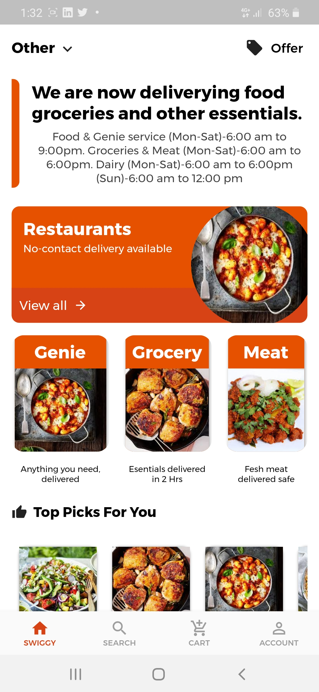|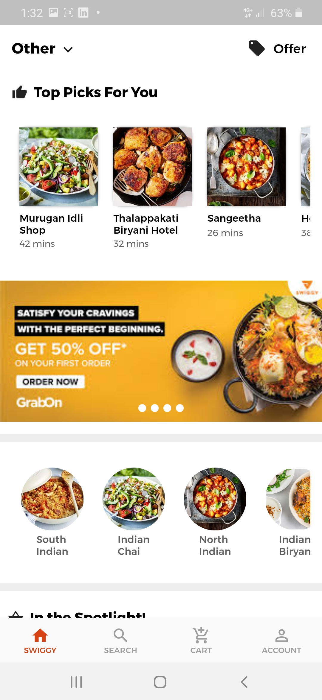|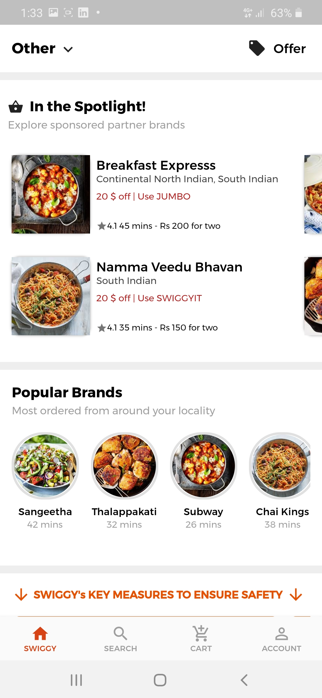|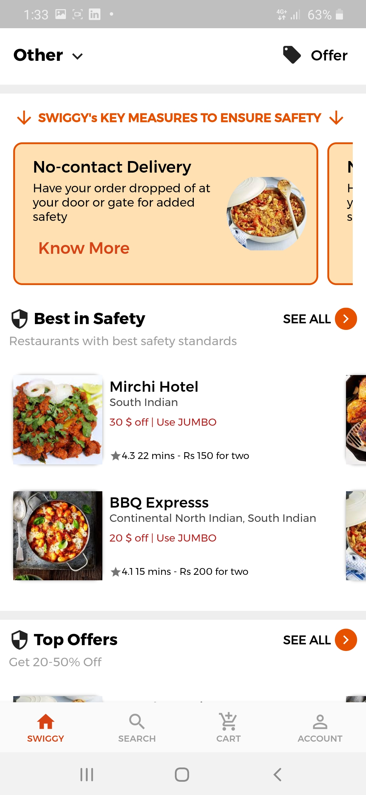|
:-------------------------:|:-------------------------:|:-------------------------:|:-------------------------:
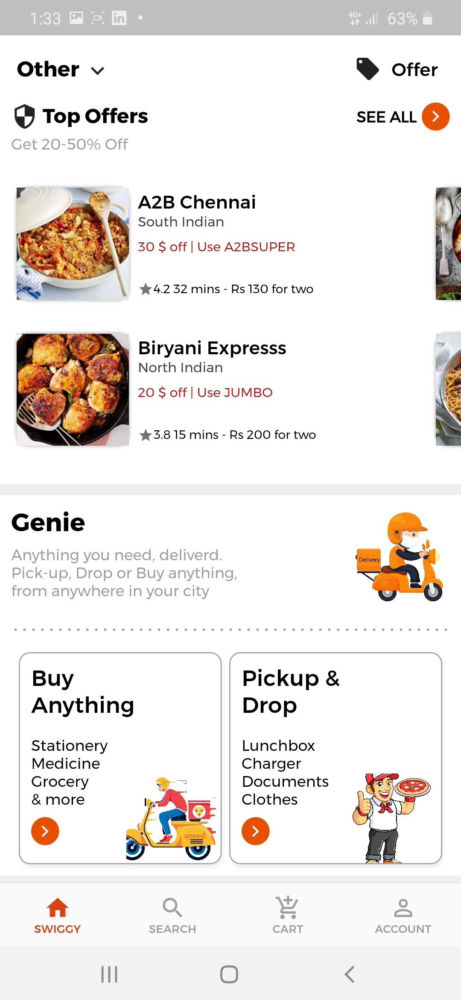|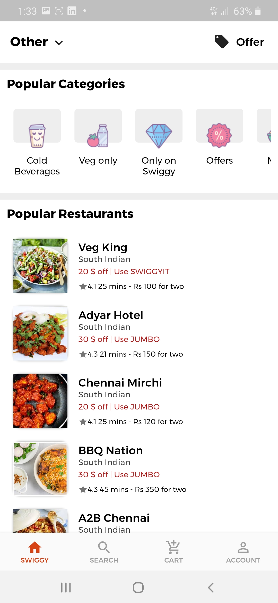|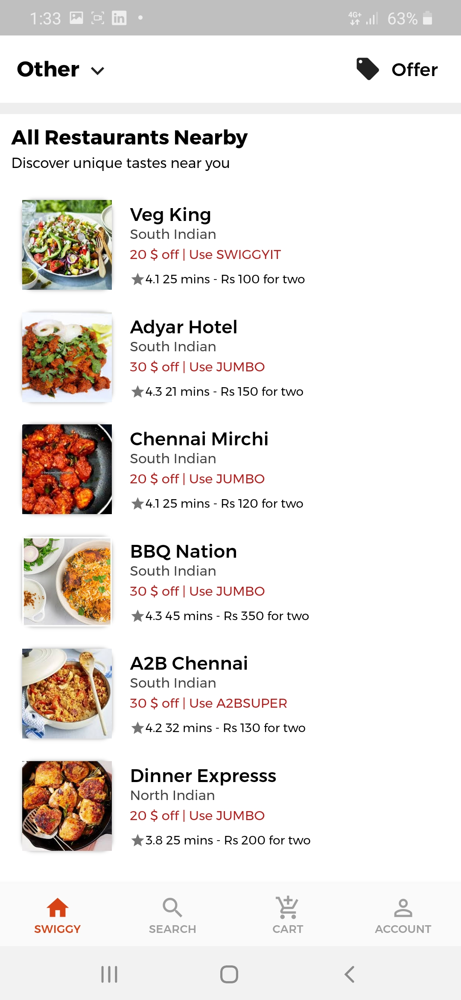|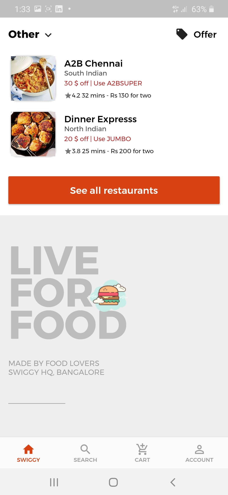|
:-------------------------:|:-------------------------:|:-------------------------:|:-------------------------:
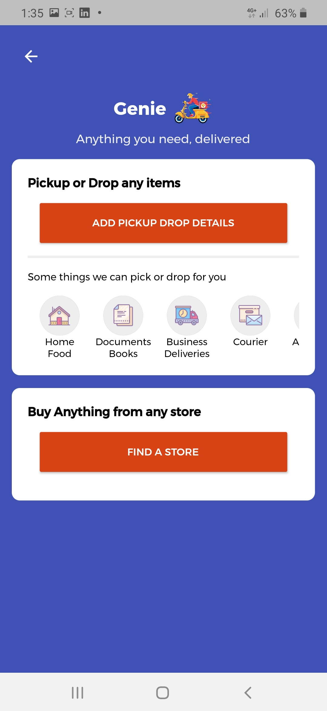|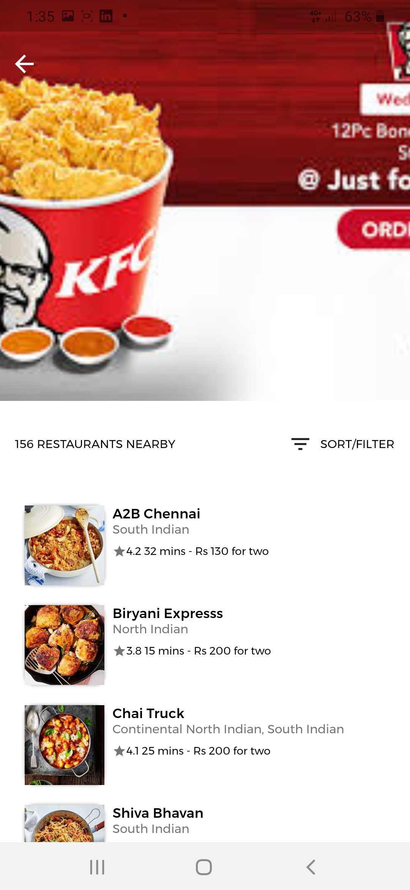|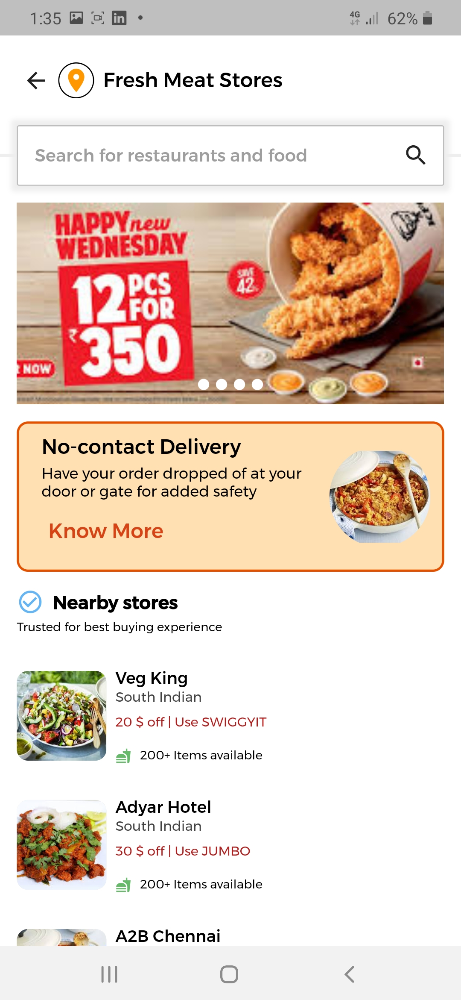|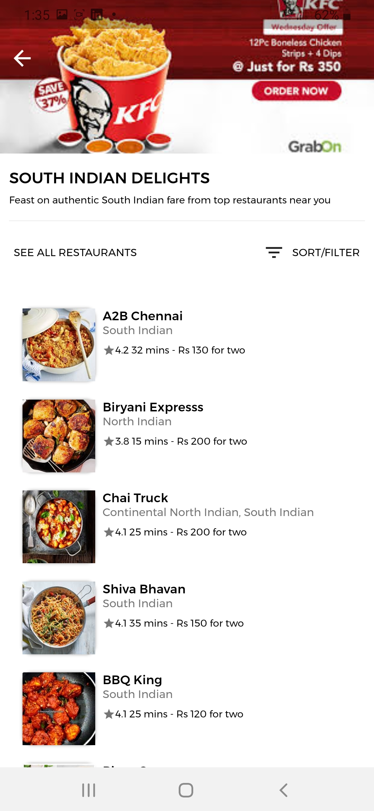|

2.Restaurant View                  
:-------------------------:|:-------------------------:|:-------------------------:|:-------------------------:
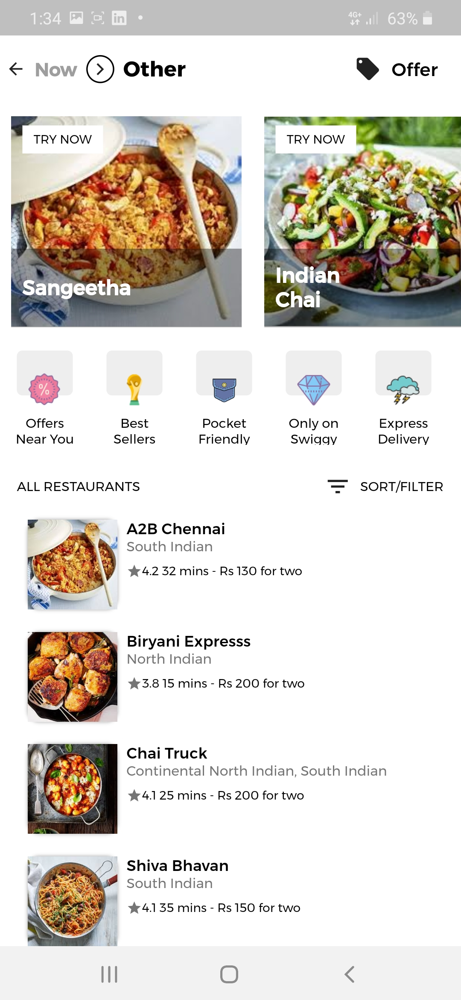|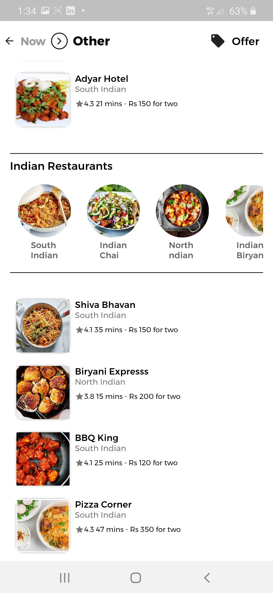|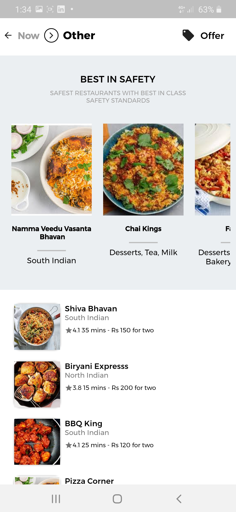|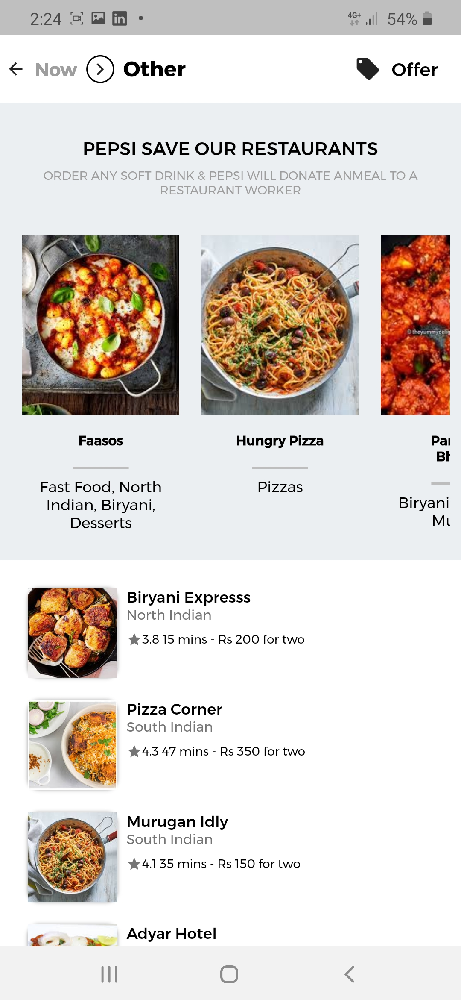|

3. Offer View                       
:-------------------------:|:-------------------------:
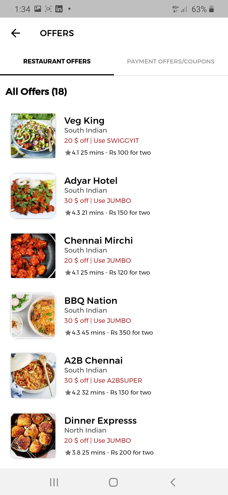||

4Restaurant detail View                
:-------------------------:|:-------------------------:
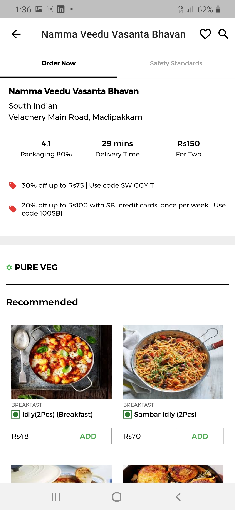|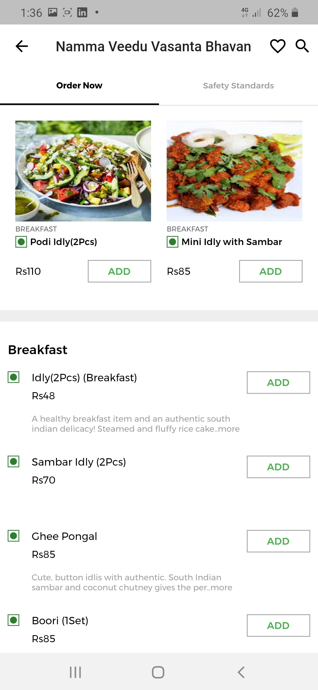|
5.Sexrch
                                 
:-------------------------:
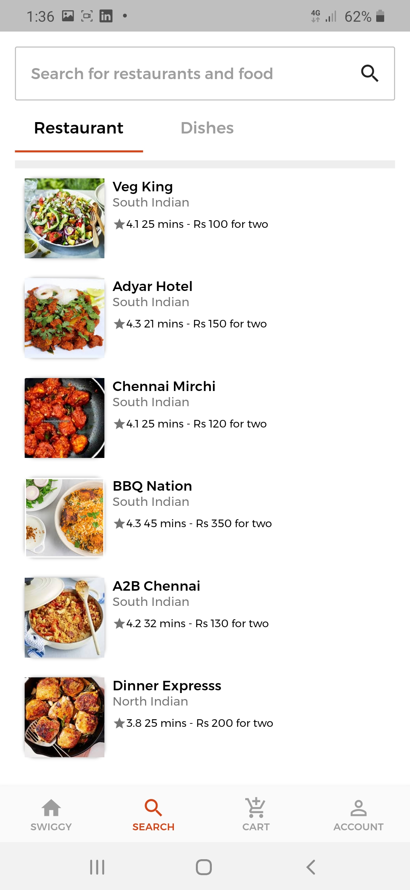|

  Made With Flutter 💙

